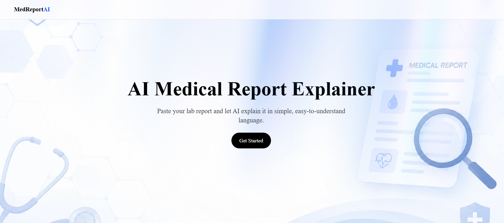

# MedReport AI 🩺

An AI-powered web app that explains lab report values in simple, easy-to-understand language — with color-coded results, multilingual support, and photo upload.
## 📸 Preview

## 🔗 Live Demo

[https://medreport-ai-gamma.vercel.app](https://medreport-ai-gamma.vercel.app)

## ✨ Features

- **AI-Powered Analysis** — Paste report values or upload a photo, and Google Gemini explains each result in plain language
- **Color-Coded Results** — Instantly see which values are Normal, Borderline, or need Attention
- **Report Type Templates** — Quick-select CBC, Thyroid, Lipid Profile, or Blood Sugar reports
- **Multilingual** — Get explanations in English or Hindi
- **Photo Upload** — Upload a photo of your lab report instead of typing values manually
- **Ask Your Doctor** — AI suggests relevant questions to discuss with your doctor
- **Sample Reports** — Try the tool instantly with pre-filled sample data
- **Dark Mode** — Clean, modern dark-themed interface
- **Custom Animations** — Aurora background, cursor glow effects, and smooth transitions

## 🛠️ Tech Stack

| Category | Technology |
|---|---|
| Framework | Next.js (App Router) |
| Language | JavaScript |
| Styling | Tailwind CSS |
| UI Components | Aceternity UI, Framer Motion |
| AI | Google Gemini API (gemini-3.1-flash-lite) |
| Deployment | Vercel |
| Version Control | Git & GitHub |

## 🏗️ Architecture Overview

The app follows Next.js App Router conventions, splitting concerns between routed pages, a secure backend API route, and reusable UI components.

| Part | Location | Responsibility |
|---|---|---|
| Landing page | `src/app/page.js` | Hero section, animated background, entry point to the tool |
| Report page | `src/app/report/page.js` | Core UI: report type selector, language toggle, text/photo input, results display |
| Analyze API route | `src/app/api/analyze/route.js` | Server-side endpoint that receives the report (text or image), builds the prompt, calls the Gemini API, and returns structured JSON — keeps the API key server-side only |
| Health check | `src/app/health/page.js` + `src/app/api/health/route.js` | A Server Component that fetches `/api/health` at request time to confirm the app and its configuration (e.g. API key presence) are working |
| UI components | `src/components/ui/` | Visual effects (Aurora background, cursor glow, rotating orb) built on Framer Motion |
| Shared utilities | `src/lib/` | Helper functions (e.g. Tailwind class merging) |

**Data flow for a report analysis:**
1. User submits report text and/or a photo from the `/report` page (Client Component — needs interactivity).
2. A `FormData` request is sent via `fetch` to `/api/analyze`.
3. The API route (running on the server) builds a prompt, optionally attaches the image, and calls the Gemini API.
4. Gemini's response is parsed as JSON and returned to the client.
5. The `/report` page renders the results as color-coded cards.

## 🤖 AI Integration

**Model used:** Google Gemini (`gemini-3.1-flash-lite`)

**Why an LLM fits this problem:** Lab reports use dense medical terminology that most patients can't easily interpret. Rather than hardcoding explanations for a fixed list of tests, an LLM can generalize across arbitrary report formats, test names, and even two input modes (typed text or a photo of a physical report), and can explain results in either English or Hindi on request.

**Prompt design:** The backend constructs a single prompt per request that:
- Specifies the desired output language (English or Hindi)
- States the selected report type (e.g. CBC, Thyroid) for context
- Instructs the model to classify each value as `NORMAL`, `BORDERLINE`, or `ATTENTION_NEEDED` against standard reference ranges
- Requires a strict JSON response shape (`results`, `summary`, `doctorQuestions`) so the frontend can reliably render it without additional parsing logic
- Asks for 2–3 relevant questions the user could bring to a doctor, turning the tool into a conversation-starter rather than a diagnostic replacement

**Structured output handling:** Gemini's response is stripped of markdown code fences and parsed with `JSON.parse`. If parsing fails or the API call errors, the route returns a clear error message rather than crashing, which the UI surfaces to the user.

## ⚠️ Known Limitations & Future Improvements

**Current limitations:**
- No automated component/unit tests cover the core report-analysis flow yet.
- Accessibility and performance have not yet been formally audited (Lighthouse / axe).
- The AI's JSON output is not schema-validated beyond a `try/catch` around `JSON.parse` — a malformed response could still slip through in an unexpected shape.
- No persistent history — analyses are not saved between sessions.
- The optional Python ML backend (risk scoring, biomarker forecasting) runs on a separate service (Render) and is not yet wired into the main report flow.

**Planned improvements:**
- Add unit tests for the report form and the `/api/analyze` route's response parsing.
- Run and document a Lighthouse + axe/WAVE audit, and fix any flagged issues.
- Add schema validation (e.g. with Zod) for the AI's JSON response.
- Persist report history per session using local storage or a lightweight database.
- Add a PDF export option for analysis results.

## ⚠️ Disclaimer

This tool is for educational purposes only and does not provide medical advice. Always consult a qualified doctor before making any medical decisions.

## 📄 License

This project is open source and available for learning purposes.

